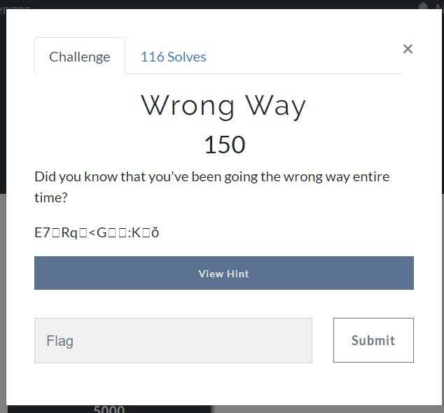
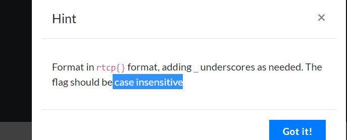
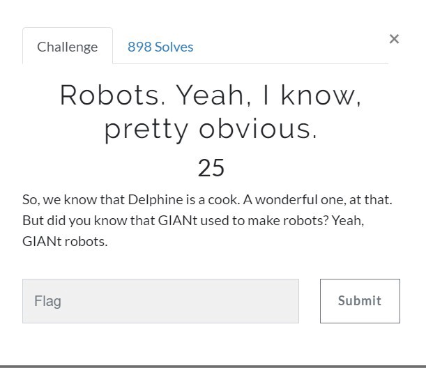
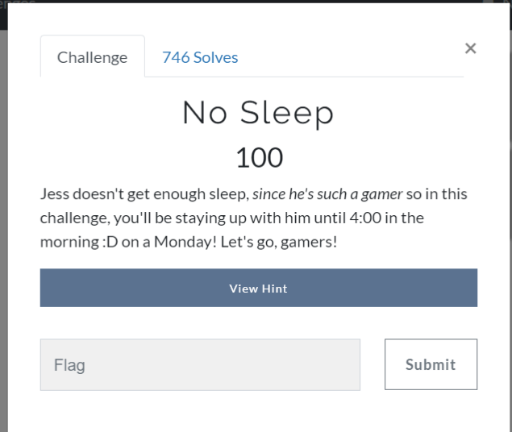

### Cryptography

**Wrong Way -**

pontos: 150

Era da string codificada “E7Rq<G:Kǒ”. A dica era que a flag seguiria o formato rtcp{}, usaria \_ underscores quando necessário e não que flag era _case insensitive_(só maiúsculas ou só minúsculas).

Usando [base64encoder](https://www.base64encode.org/) na string “E7Rq<G:Kǒ” obteve a flag. Fazendo o encode na string seria obtida a string “RTcPUnEXPEcTEDpLAceS” passando para formato conforme a dica ficaria: rtcp{UNEXPECTED\_PLACES} (OBS: a flag só foi aceita com upper case).

#### Flag: rtcp{UNEXPECTED\_PLACES}

### Web

### Robots. Yeah, I know, pretty obvious. -

pontos: 25

Pelo nome já fui para o [_robots.txt_](https://rockcontent.com/blog/robots-txt/)  do site [https://riceteacatpanda.wtf/robots.txt](https://riceteacatpanda.wtf/robots.txt):

Acessando o endereço do /flag encontraria essa clássica [Rick Astley — Never Gonna Give _You_ Up](https://youtu.be/dQw4w9WgXcQ) e acessando /robot-nurses lá estaria sua flag rtcp{r0b0t5\_4r3\_g01ng\_t0\_t4k3\_0v3r\_4nd\_w3\_4r3\_s0\_scr3w3d}.

**Flag: rtcp{r0b0t5\_4r3\_g01ng\_t0\_t4k3\_0v3r\_4nd\_w3\_4r3\_s0\_scr3w3d}**

### No Sleep -

pontos: 100

Acessando a página no _View Hint_ teria a mensagem “ Jess will let you be a real gamer in: ” e tempo dependo do dia do ctf em que estava fazendo o desafio, o tempo acabava dia 24. usei o [EditThisCokkie](http://www.editthiscookie.com/) de extensão do Chrome para editar o para dia em que acaba, isso poderia ser feito de várias formas. O timer contava o tempo que faltava e o tempo que passou se alterasse 2 dias frente não teria a flag.

